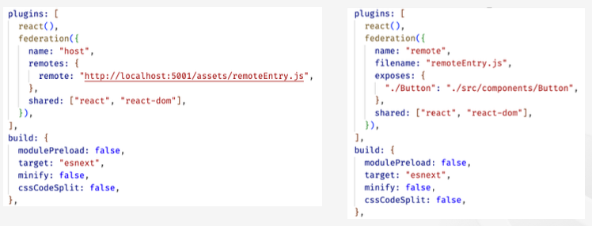

# @originjs/vite-plugin-federation 소개

- Module Federation 을 지원하는 Vite/Rollup 플러그인 입니다. Webpack 에서 영감을 받았으며 Webpack Module Federation 과 호환되는 것을 목표로 합니다.
- Vite 공식 지원 플러그인이 아니기 때문에 프로덕션에서의 안정성을 Vite 에서 담보하진 않습니다.
- Vite 를 만든 Evan You 는 2023 ViteConf 에서 Module Federation 에 대한 부족함을 언급했습니다. (https://www.youtube.com/watch?v=veCxKeLl35A&t=1400s)
- 호스트 측에서만 개발 모드를 지원하며, 리모트 측에서는 vite build 를 사용하여 remoteEntry.js 를 생성해야 합니다. 리모트에서 vite build —watch 를 이용하면 개발 모드에서 도움이 됩니다.

# Vite Module Federation 설정

1. 플러그인을 이용해서 remote 앱을 설정

- vite.config.ts 설정 파일에서 구성되며, 공유할 모듈의 name, filename, exposes, shared 등을 정의합니다.

2. 원격 엔트리 파일 생성

- 플러그인은 원격 애플리케이션을 위한 remoteEntry.js 파일을 생성합니다. Vite 의 개발 모드로는 원격 엔트리 파일이 생성되지 않기 때문에 vite build 를 이용합니다.

3. host 앱의 설정에 remote 앱을 등록

- 원격 애플리케이션의 exposes 객체를 통해 모듈을 사용하려면 host 앱의 vite.config.ts 에 remotes 부분에 remote 앱을 등록합니다.

4. 동적 모듈 연결

- 호스트 애플리케이션의 코드애서 import() 를 통해 원격 모듈을 사용합니다.

# vite.config.ts 설정

# 주의사항

- Vite 프로젝트에서 노출한 모듈을 Webpack 프로젝트에서 사용하거나, Webpack 프로젝트에서 노출한 모듈을 Vite 프로젝트에서 사용할 수 있습니다. 이 때는 remotes.from 과 remotes.format를 적절히 선택해야 합니다.
- Webpack 은 esm 형식을 사용하는 vite-plugin-federation 컴포넌트와 함께 사용하는 것이 가장 좋습니다.
- Vite/Rollup 과 Webpack 이 동일한 청크를 생성한다는 보장이 없어 shared 에 문제가 발생할 수 있으므로, React 프로젝트에서 Vite 와 Webpack을 혼합하는 것은 권장하지 않습니다.

# 정리

- Webpack Module Federation 기술을 Webpack 이 아닌 곳에서도 사용하려는 노력은 계속되고 있습니다.
- Vite 에서는 공식 지원하지 않지만 커뮤니티에서 제공하고 있는 플러그인인 @originjs/vite-plugin-federation 이 있습니다.
- @module-federation/vite 도 있으며, 이 플러그인은 브라우저에서 모듈 페더레이션을 사용하고자 하는 native-federation 을 활용합니다.
- 노력은 계속되고 있으며 Webpack 을 넘어서는 기술이 되기 위한 시도가 많이 있습니다.
- 여러가지 이슈로 인해 아직 프로덕션에서 활용이 가능한 수준인지는 각자의 판단이 필요합니다.
