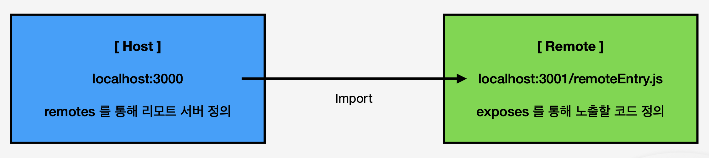
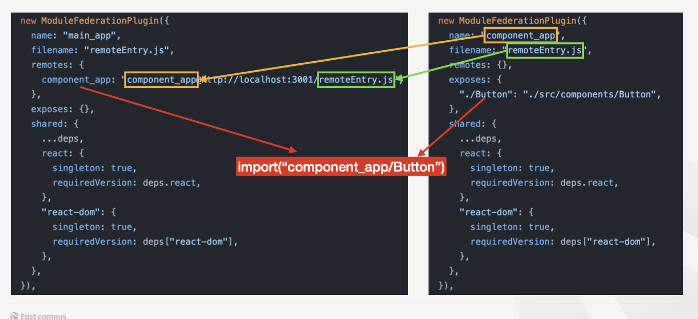

# Module Federation 이란 무엇인가

- Module Federation 은 Webpack5 에서 소개된 고급 모듈 통합 기능 입니다.
- 여러 JavaScript 애플리케이션 간에 코드를 동적으로 공유할 수 있게 해줍니다.
- 다른 접근 방식과 달리 모듈 페더레이션은 기존 코드베이스를 변경할 필요가 없습니다. 오직 Webpack 이 모듈을 원격으로 로드하도록 처리해줍니다.
- 모듈 페더레이션은 UI 컴포넌트, 비즈니스 로직 등 모든 유형의 자바스크립트에 사용할 수 있습니다. 모든 자바스크립트를 공유할 수 있습니다.
- 마이크로프론트엔드 아키텍처에서 특히 유용하며, 다양한 애플리케이션들이 서로 독립적으로 개발되
  고 배포될 수 있도록 지원합니다.

# Module Federation 핵심 구성요소

- Host
  - Host 애플리케이션은 다른 애플리케이션(remotes)으로부터 모듈을 로드합니다. Host 는 웹 애플리케이션의 '메인' 부분으로 생각할 수 있습니다.
- Remote
  - Remote 애플리케이션은 Host 에 로드될 수 있는 모듈을 제공합니다. 이들은 독립적으로 배포할 수 있는 별도의 코드베이스를 가집니다.
- Shared
  - Shared 모듈은 여러 애플리케이션 간에 공유되는 의존성입니다. 이를 통해 중복된 코드의 로딩을 방지하고, 일관된 의존성 관리를 가능하게 합니다.

# Module Federation 동작 원리

1. 플러그인 구성

- ModuleFederationPlugin 은 Webpack 설정 파일에서 구성되며, 원격 호스트와 공유할 모듈 등의 세부 사항을 정의합니다.

2. 원격 엔트리 파일 생성

- 플러그인은 원격 애플리케이션을 위한 remoteEntry.js 파일을 생성합니다. 이 파일은 원격 애플리케이션의 인터페이스 역할을 하며, 호스트 애플리케이션에서 원격 모듈을 로드할 때 사용됩니다.

3. 모듈 노출

- 원격 애플리케이션에서는 exposes 객체를 통해 특정 모듈을 외부에 노출합니다. 이렇게 함으로써, 다른 애플리케이션들이 이 모듈을 사용할 수 있게 됩니다.

4. 동적 모듈 연결

- 호스트 애플리케이션은 원격 애플리케이션의 remoteEntry.js 를 참조하고, 필요한 모듈을 동적으로 로드합니다. 이는 주로 import() 문을 사용하여 수행됩니다.

# Module Federation 동작 원리의 이해

- Remote 애플리케이션은 자체적인 빌드 과정을 통해 remoteEntry.js 와 같은 원격 엔트리 파일을 생성합니다. 이 파일은 원격 모듈의 메타데이터와 주소를 포함합니다.
- Host 애플리케이션은 remoteEntry.js 를 참조하여 필요한 모듈을 요청합니다. 이 요청은 Webpack의 런타임 코드에 의해 처리되며, 필요한 경우 네트워크를 통해 해당 모듈을 로드합니다.

# 정리

- Webpack5 에는 ModuleFederationPlugin 이 내장되어 있습니다. 이 플러그인을 이용하면, 코드베이스의 변경 없이 import 구문으로 다른 서버에 있는 모듈을 사용할 수 있습니다.
- ModuleFederationPlugin 의 설정에는 여러가지가 있지만, 핵심적인 요소로는 remotes,exposes, shared 가 있습니다.
- remotes 는 Host 애플리케이션에서 사용할 다른 원격 애플리케이션을 정의합니다.
- exposes 는 원격 애플리케이션에서 노출할 모듈을 정의합니다. 이러한 모듈들은 웹팩이 빌드하여, remoteEntry.js 와 같은 filename 항목에 포함됩니다.
- shared 항목은 Host 와 Remote 애플리케이션들이 함께 쓰는 라이브러리들에 대해 설정합니다.
